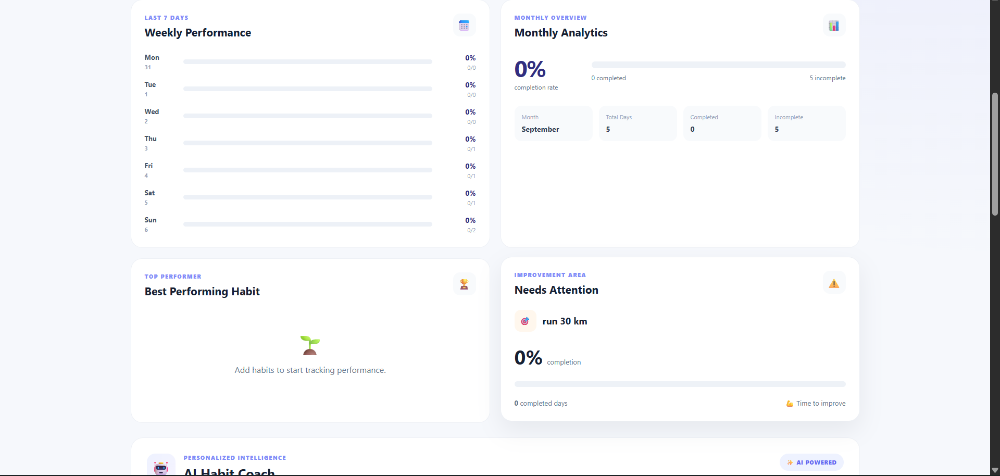
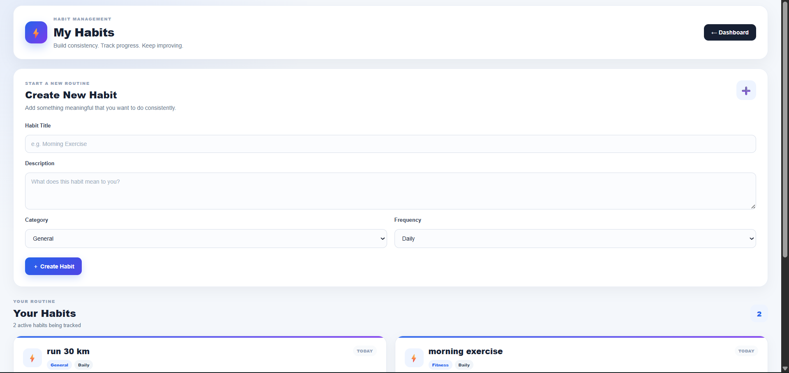
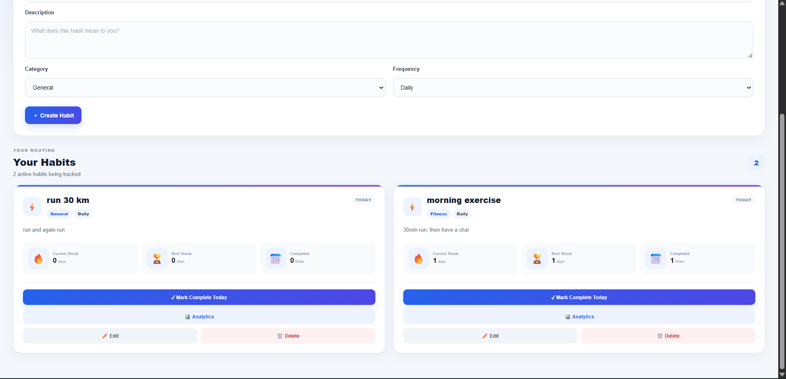
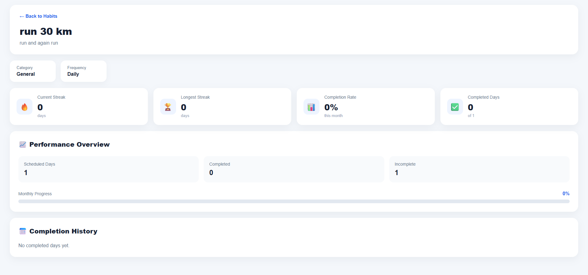
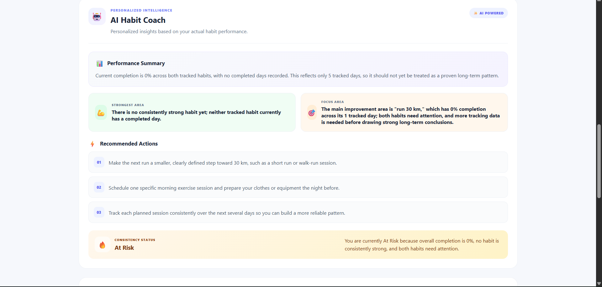
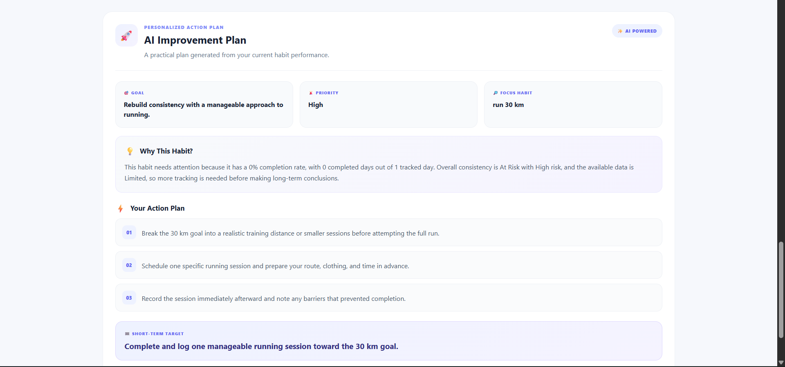
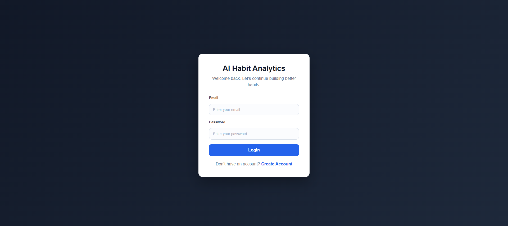
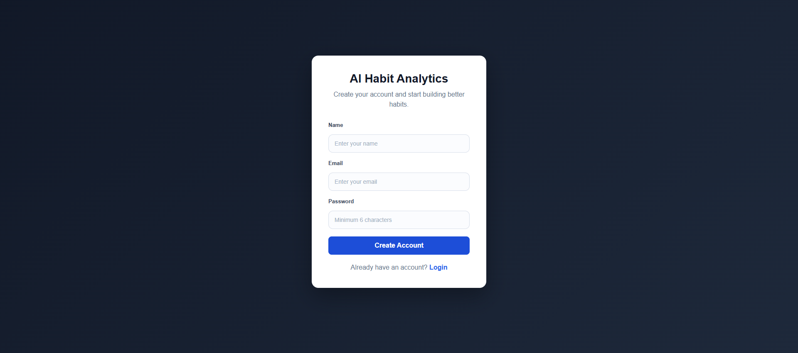

# AI Habit Analytics

A full-stack MERN application that helps users build better habits by tracking daily and weekly activities, analyzing performance, monitoring streaks, and generating personalized AI-powered insights and improvement plans.

## 🔗 Project Links

- **GitHub Repository:** [AI Habit Analytics](https://github.com/kritik-24/AI-Habit-Analytics)
- **Live Demo:** [View Live Project](https://ai-habit-analytics-1.onrender.com)


## 📸 Screenshots

### 🏠 Dashboard





### 📝 Habit Management




### 📊 Analytics



### 🤖 AI-Powered Insights




### 🔐 Authentication




### 🔐 REGISTER



## 🚀 Features

### 🔐 Authentication
- User Registration and Login
- JWT-based Authentication
- Protected Routes
- Secure Password Handling

### 📝 Habit Management
- Create Habits
- Update Habits
- Delete Habits
- Daily and Weekly Habit Support
- Habit Categories
- Active Habit Management

### ✅ Habit Tracking
- Mark Habits as Completed
- Track Completion History
- Daily Completion Tracking
- Weekly Habit Tracking

### 🔥 Streak System
- Current Habit Streak
- Longest Streak Tracking
- Consistency Monitoring

### 📊 Analytics Dashboard
- Overall Completion Percentage
- Weekly Performance Analytics
- Monthly Performance Analytics
- Habit Performance Analysis
- Best Performing Habit
- Habit That Needs Attention
- Total Habit Statistics

### 🤖 AI Habit Coach
- Personalized Performance Summary
- Strongest Area Analysis
- Improvement Area Identification
- Personalized Recommendations
- Consistency Status and Feedback

### 🚀 AI Improvement Plan
- Personalized Goal
- Priority Identification
- Focus Habit Recommendation
- Improvement Reasoning
- Actionable Steps
- Short-Term Target
- AI Coach Encouragement

## 🛠️ Tech Stack

### Frontend
- React.js
- React Router DOM
- Axios
- CSS

### Backend
- Node.js
- Express.js
- RESTful APIs

### Database
- MongoDB
- Mongoose

### Authentication & Security
- JSON Web Token (JWT)
- bcryptjs
- Environment Variables

### AI Integration
- OpenAI API

### Deployment
- Frontend: Render
- Backend: Render
- Database: MongoDB Atlas

## 📁 Project Structure

```text
ai-habit-analytics
│
├── client
│   ├── src
│   │   ├── components
│   │   ├── context
│   │   ├── pages
│   │   ├── services
│   │   └── ...
│   │
│   └── package.json
│
├── server
│   ├── config
│   ├── controllers
│   ├── middleware
│   ├── models
│   ├── routes
│   ├── services
│   ├── validators
│   ├── utils
│   └── ...
│
├── .gitignore
├── package.json
└── server.js
```

## ⚙️ Installation

### 1. Clone the Repository

```bash
git clone https://github.com/kritik-24/AI-Habit-Analytics.git
```

### 2. Install Dependencies

Install root/server dependencies:

```bash
npm install
```

Install frontend dependencies:

```bash
cd client
npm install
```

### 3. Configure Environment Variables

Create a `.env` file and add the required environment variables:

```env
PORT=5000
MONGO_URI=_mongodb_connection_string
JWT_SECRET=_jwt_secret
OPENAI_API_KEY=_openai_api_key
```

> Never commit your `.env` file or API keys to GitHub.

### 4. Run the Application

Start the backend:

```bash
npm start
```

Start the frontend:

```bash
cd client
npm run dev
```

## 📊 Analytics

The application analyzes user habit data and provides:

- Overall completion percentage
- Last 7 days performance
- Monthly completion statistics
- Best performing habit
- Habit requiring improvement
- Completion consistency

## 🤖 AI-Powered Insights

The AI system analyzes the user's actual habit performance and generates personalized feedback.

It provides:

- Performance summaries
- Strongest areas
- Areas needing improvement
- Recommended actions
- Consistency analysis

## 🎯 AI Improvement Plan

Based on habit analytics, the application generates a personalized improvement plan containing:

- Main goal
- Priority area
- Focus habit
- Reason for improvement
- Actionable recommendations
- Short-term target
- Motivational guidance

## 🔒 Security

The application implements:

- JWT Authentication
- Password Hashing
- Protected API Routes
- Authentication Middleware
- Environment Variable Protection
- Secure API Key Storage

## 🌐 Deployment

The application is deployed using:

- Frontend: Render
- Backend: Render
- Database: MongoDB Atlas

## 👨‍💻 Author

**Kritik**

Full Stack Developer | MERN Stack Developer

## 📌 Future Improvements

- Habit reminder notifications
- Advanced data visualization
- Mobile application
- Social habit challenges
- Habit sharing
- Calendar integration

---

⭐ If you found this project interesting, consider giving the repository a star!